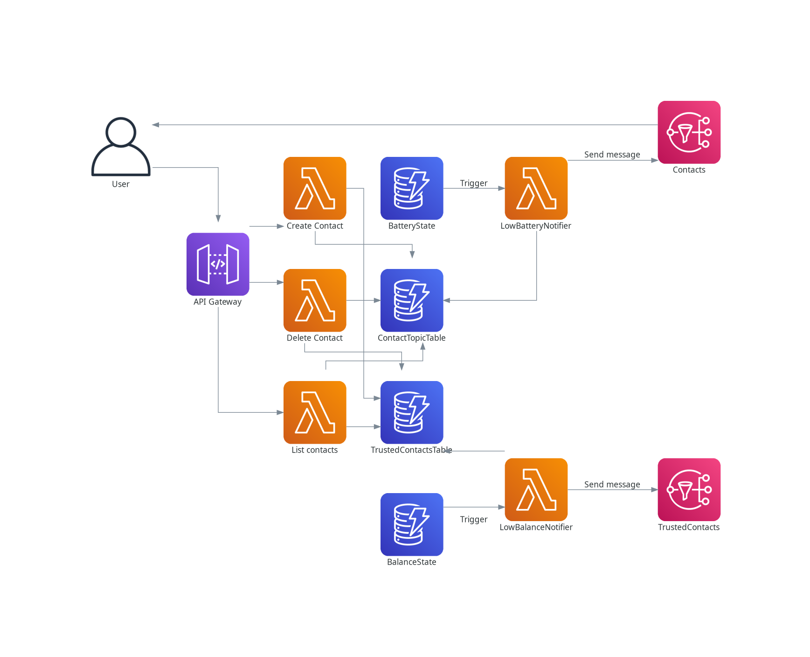

# SerenUp - Serverless application

## Data ingestion
Amazon Kinesis does not allow storing data coming from a Kinesis Data Stream directly,
although there's the possibility to use a lambda function that reads information from the stream and write into a Timestream database.


## Notifications
A user can set its contacts information or add new trusted contacts through the APIs.
Contacts endpoints (e.g. email address or phone number) are then subscribed to an SNS Topic.

Alerts are triggered by a DynamoDB Stream Event that happens when a record has been updated.
A lambda (Notifier) is listening to an event, fetch the data and eventually sends a message through the SNS Topic
associated to the users' category.

Currently, only 2 categories have been implemented:
- Notifications: Used for sending notifications to the user
- Trusted contacts: A list of trusted contacts, may be parents or friends of the user, to alert when the user falls




## API documentation
AWS API gateway allow to download current API design in OpenAPI 3.0 format:
```
aws apigateway get-export --rest-api-id <aws-api-gateway-id> --stage-name Prod --export-type oas30 openapi30.json
```
